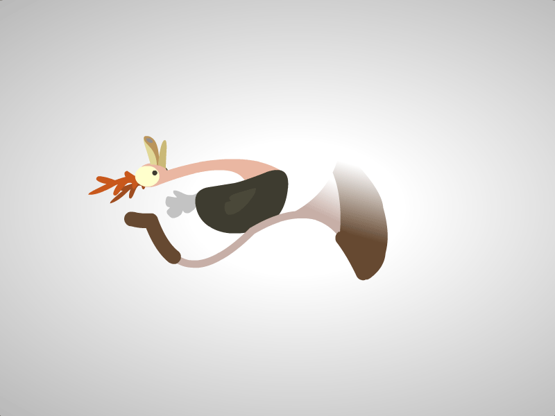

# Ostrich

> This project has been deprecated!

## How to use
1. git clone https://github.com/uinika/ostrich.git
2. cd leo
3. npm install
4. gulp client / server
5. Open browser http://localhost:5002/client/

## Library
* [Angular 1.5.x](https://angularjs.org/)
* [UI Router 0.3.x](https://github.com/angular-ui/ui-router/tree/legacy)
* [UI Bootstrap 1.3.x](https://angular-ui.github.io/bootstrap/)
* [Lodash 1.5.x](https://lodash.com/)
* [q 1.4.x](https://github.com/kriskowal/q)
* [NodeJS 6.2.x](https://nodejs.org/)
* [Mongoose 4.x.x](http://mongoosejs.com/)
* [Express 4.x.x](https://expressjs.com/)